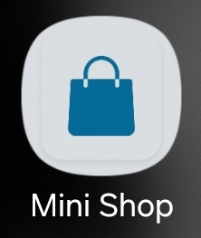

# Mini Shop Uygulaması

Mini Shop, kullanıcıların ürünleri keşfedebileceği, detaylarını görüntüleyebileceği ve sepetlerine ekleyebileceği modern, sade ve akıllı bir e-ticaret uygulamasıdır.

Uygulama, ürünleri etkileyici bir şekilde sunarak kusursuz bir mobil alışveriş deneyimi yaşatmayı hedefler. Kolay kullanılabilir bir arayüz, pratik menüler ve net ürün gösterimleri sunar. Ürün arama filtrelemesi, detay sayfası incelemesi ve interaktif sepet yapısı ile temel bir çevrimiçi mağaza sisteminin çalışma prensiplerini modern bir tasarımla barındırır.

## Ekran Görüntüleri

| Uygulama İkonu | Ana Sayfa | Ürün Detay | Sepet |
|:---:|:---:|:---:|:---:|
|  |  |  |  |

## Neler Sunuyor?
- **Ürün Keşfi:** Şık tasarım ve basit arayüzü sayesinde vitrindeki ürünler rahatça gözden geçirilir. Arama kutusu ile hedeflenen ürüne saniyeler içinde ulaşılır.
- **Detaylı Gösterim:** Seçilen ürünün özelliklerine, açıklamalarına ve fiyatına yakından bakılmasını sağlayan net bir detay sayfası içerir.
- **Akıllı Sepet Yönetimi:** Sepete eklenen ürünler listelenir, toplam tutar otomatik hesaplanır ve vazgeçilen ürünler sepetten dinamik olarak çıkarılabilir.
- **Ödeme Simülasyonu:** Sepetteki ürünlerin sipariş onayı sonrasında başarılı bir şekilde satın alınma simülasyonu sunulur ve süreç sonunda sepet otomatik olarak işlemden kalkar.
