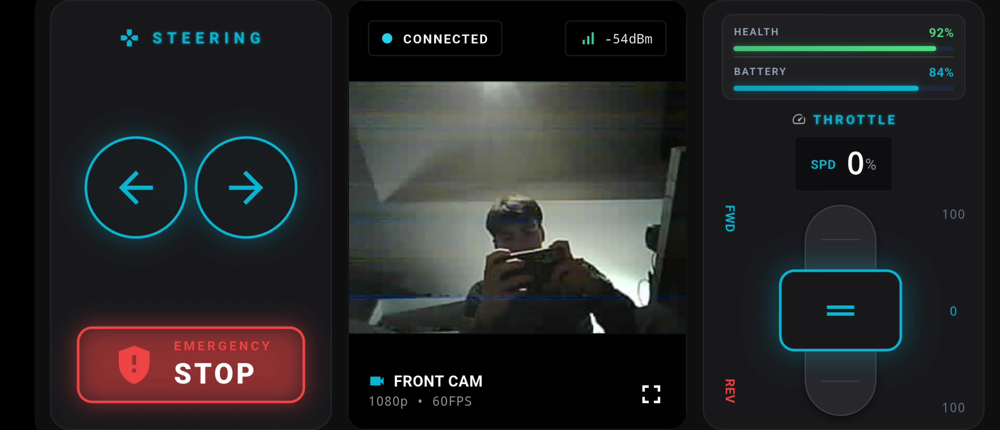

# RC Car Controller

**RC Car App** is a mobile interface designed to control your ESP32-based remote control car. You can connect to the vehicle via Wi-Fi to watch the live camera feed and steer the car.

## Features
- **Wi-Fi Control:** Low-latency wireless communication.
- **Live Camera:** Instant video stream transmission via ESP32-CAM.
- **User-Friendly Controls:** Precise buttons for gas, brake, and steering.

## Interface

---

# RC Car Controller (Türkçe)

**RC Car App**, ESP32 tabanlı uzaktan kumandalı aracınızı kontrol etmeniz için tasarlanmış mobil arayüzdür. Wi-Fi üzerinden araca bağlanarak canlı kamera görüntüsünü izleyebilir ve aracı yönlendirebilirsiniz.

## Özellikler
- **Wi-Fi Kontrol:** Düşük gecikmeli kablosuz iletişim.
- **Canlı Kamera:** ESP32-CAM üzerinden anlık görüntü aktarımı.
- **Kullanıcı Dostu Kontroller:** Gaz, fren ve yönlendirme için hassas butonlar.

## Arayüz

---
> ⚠️ **Access Notice / Erişim Bildirimi:**
>
> **EN:** To access the source code and APK file of this project, please contact the project owner.
>
> **TR:** Bu projenin kaynak kodlarına ve APK dosyasına ulaşmak için lütfen proje sahibi ile iletişime geçiniz.
